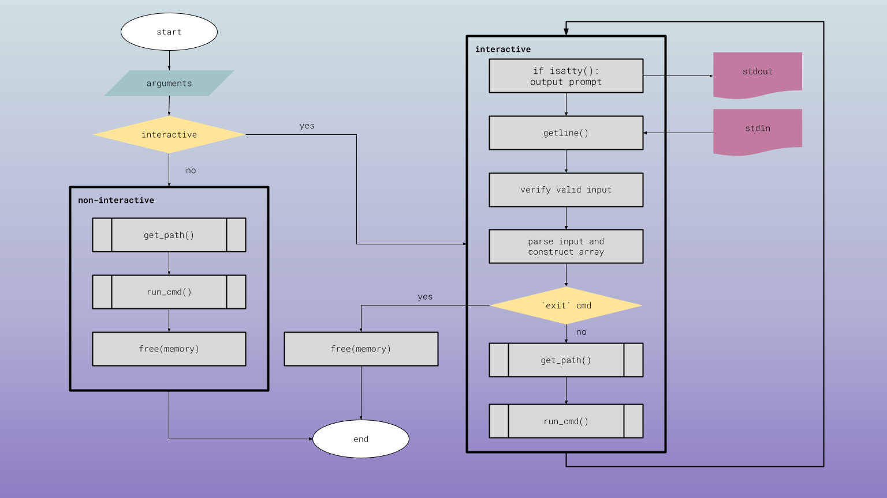

# $$hell: A Shell with an Attitude


## Brief

Buckle Up, Buttercup! Introducing $$hell, the Shell with an Attitude! 💅 A bare-bones Unix shell implementation in C, perfect for learning the ropes of process management and command execution.

## Table of Contents
1. Description
	1. Operation
	2. Installation
	3. Features
	4. Limitations
	5. Examples
	6. Bugs
2. Status and Roadmap
3. Documentation and Support
4. Acknowledgements
5. Resources
6. Licence

# Description
## Operation


## Installation

1. Compile: If you can't figure this out, you probably shouldn't be using a shell. But whatever...

```bash
gcc -Wall -Werror -Wpedantic -o $$$hell simple_shell.c

2. **Run**
Bash
./$$$hell

Now you'll see the super cool prompt:

$$$hell :: 
Interactive: ./$$hell
Non Interactive: ./$$hell <command> (Don't forget to replace command with something worthy of my attention


Example
$$$hell :: /bin/ls
$$$hell :: /usr/bin/whoami
$$$hell :: exit
exiting...
```
## Features that'll make you go "YAS Queen":

* **Command Execution:** Runs external commands entered by the user (e.g., `/bin/ls`, `/usr/bin/whoami`).
* **Non-Interactive Mode (Because who needs friends right?): Feed me a single command and I'll execute it, no chit chat, just results. 
* **Interactive Mode (Oh someone's feeling social now huh?): Hang out in my shell and type commands to your heart's content. But don't expect me to be impressed.
* **Built in sass and command support (for only the ones I want): Every prompt is a reminder you're in a shelll that knows it's worth.
* **Environmentally conscious: I CAN display your environment variables using the 'env' command. Because even a sassy shell cares about it's surroundings. 
* **Pathfinder Extraordinaire: I can locate commands like a pro, even if they're hiding.  
* **Argument Handling:** Supports commands with arguments (e.g., `ls -l /tmp`).
* **"exit" (stage left) Command:** When you've had enough of me, just type exit and I'll let you go.
* **Ctrl+D (EOF) Handling:** Exits when you're done playing around.
* **Error Handling:** Catches those pesky `fork` and `execve` fails, letting you know what's up.

## Limitations
* **No Fancy Stuff:** Forget about pipes (`|`), redirection (`>`, `<`), or wildcards (`*`). This shell keeps it simple.

## Examples
## Bugs

# Status and Roadmap
abandoned. we wish to leave this behind. 

# Documentation and Support
none, but if you want a bit more details, here's this. now, leave us alone.
``` 
man ./man_1_simple_shell
```
# Acknowledgments
coffee :pray: 
# Resources
# License
do what you want. Disclaimer: I'm not responsible for any eyerolls or spontaneous hair flips caused by my sassiness.
