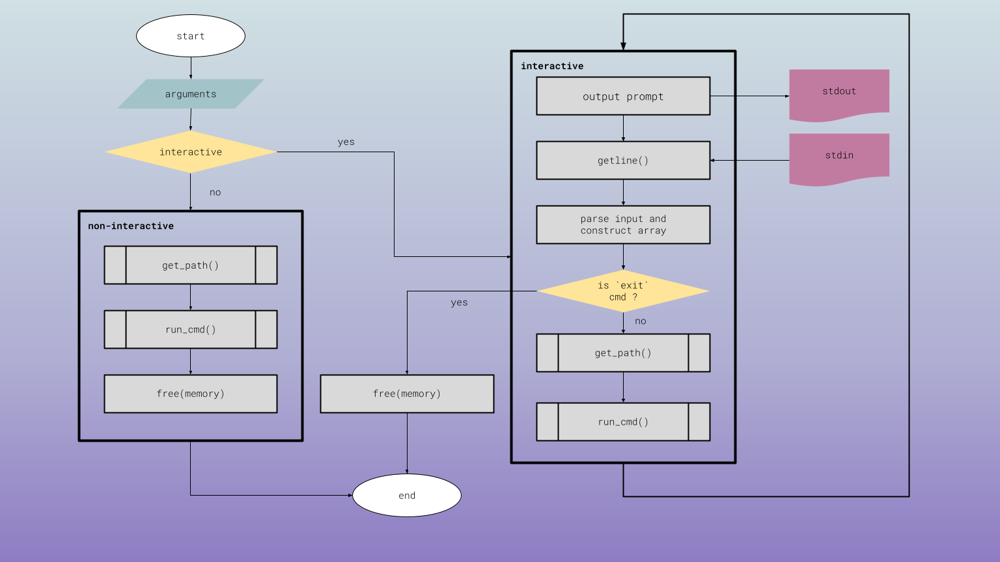

# $$$hell: A Simple Shell with Attitude

## Description

A bare-bones Unix shell implementation in C, perfect for learning the ropes of process management and command execution.

## Table of Contents

## Operation


## Installation
## Usage
### Examples
## Bugs
## Status and Roadmap
## Documentation and Support
## Acknowledgments
## Resources
## License

## Features

* **Command Execution:** Runs external commands entered by the user (e.g., `/bin/ls`, `/usr/bin/whoami`).
* **Argument Handling:** Supports commands with arguments (e.g., `ls -l /tmp`).
* **"exit" Command:** Gracefully terminates the shell.
* **Ctrl+D (EOF) Handling:** Exits when you're done playing around.
* **Error Handling:** Catches those pesky `fork` and `execve` fails, letting you know what's up.

## Limitations

* **No PATH Search:** You gotta give the full path to commands, no shortcuts!
* **No Built-ins:** No fancy `cd` or `env` commands here, just the basics.
* **No Fancy Stuff:** Forget about pipes (`|`), redirection (`>`, `<`), or wildcards (`*`). This shell keeps it simple.

## Usage

1. **Compile:**

```bash
gcc -Wall -Werror -Wpedantic -o $$$hell simple_shell.c

2. **Run**
Bash
./$$$hell

Now you'll see the super cool prompt:

$$$hell :: 
Type your command (with full path!) and hit Enter.

Example
$$$hell :: /bin/ls
$$$hell :: /usr/bin/whoami
$$$hell :: exit
exiting...
